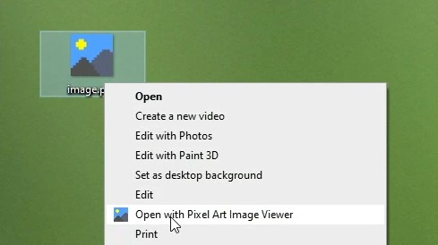

# Pixel Art Image Viewer
View your pixel art images without blur and zoom limits.

The problem of other image viewing programs is, that a blur filter gets applied to the image. 
This works fine for high-res photos, but not for low-res pixel art. Also, zooming doesn't really work either in most programs. That's why I made this software.

The software also contains an automatic updater. It checks every week, if there is a new release on sourceforge and installs it if you want.

## Usage
Using Pixel Art Image Viewer is easy.
Just right-click on an image and press `Open with Pixel Art Image Viewer` in the context menu.

## Requirements
The software requires JRE 1.8 and only runs on Windows.

## Known Issues
- When resizing, the image doesn't scale

## Contribute
Contributions are always welcome!

The project requires JDK 1.8 to compile.
Newer versions don't work because javafx.scene.image.ImageView.impl_createPeer was dropped.

- Creating a .jar and move it to `PixelArtImageViewer Compile/Pixel Art Image Viewer.exe`
- To convert the .jar to a .exe from Launch 4j is used. (Config file: `PixelArtImageViewer Compile/PixelArtImageViewer.xml`)
- For the creation of the setup.exe and the registry entries Inno Setup is used. (Config file: `PixelArtImageViewer Compile/PixelArtImageViewer.iss`)

## License
Pixel Art Image Viewer is licensed under [GNU GENERAL PUBLIC LICENSE](https://www.gnu.org/licenses/gpl-3.0.en.html).

## Credits
Thanks to:
- james-d
- clarkbean710
- ajeje93
- Martin Sojka
- alex
- slartidan
- ItachiUchiha